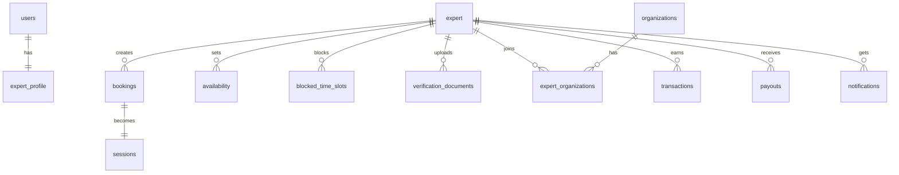

# DigitalOffices Database Schema

## Overview

Complete database schema for the DigitalOffices platform using PostgreSQL and Drizzle ORM.

## 📋 Schema Files Created

### **Core Tables**

#### 1. Users (`users.ts`)
- `client` - Client user accounts
- `expert` - Expert user accounts  
- `organisation` - Organization accounts
- `admin` - Admin user accounts

#### 2. Expert Profile (`expert-profile.ts`)
- `expertProfile` - Extended expert information

#### 3. Organizations (`organizations.ts`)
- `organizations` - Organization details
- `expertOrganizations` - Expert-Organization relationships

#### 4. Bookings (`bookings.ts`)
- `bookings` - Appointment bookings

#### 5. Availability (`availability.ts`)
- `availability` - Expert working hours
- `blockedTimeSlots` - Vacation/blocked times

#### 6. Sessions (`sessions.ts`)
- `sessions` - Video call sessions

#### 7. Earnings (`earnings.ts`)
- `transactions` - Financial transactions
- `payouts` - Expert payouts

#### 8. Notifications (`notifications.ts`)
- `notifications` - User notifications

#### 9. Verification (`verification.ts`)
- `verificationDocuments` - Expert verification docs

## 🏗️ Table Relationships



## 📊 Key Features

### **Authentication System**
- Multi-role users (client, expert, organization, admin)
- JWT-based authentication
- Email verification
- Google OAuth integration

### **Expert Verification**
- Document upload system
- Admin approval workflow
- Status tracking (ONBOARDING → PENDING_INITIAL → LIVE/REJECTED)

### **Booking System**
- Online/offline consultations
- Status management (pending → confirmed → completed/cancelled)
- Payment tracking
- Meeting integration

### **Organization Management**
- Expert can join organizations
- Approval workflow
- Role-based access

### **Financial System**
- Transaction tracking
- Commission calculation
- Payout processing
- Earnings analytics

### **Real-time Features**
- Session management
- Whiteboard integration
- Notification system

## 🚀 Next Steps

### **1. Generate Migrations**
```bash
npm run db:generate  # Generate migration files
npm run db:migrate     # Run migrations
```

### **2. Update API Services**
Replace TODO comments in `DatabaseService` with actual Drizzle queries:

```typescript
// Example:
async findExpertById(expertId: string) {
  const expert = await this.db
    .select()
    .from(expert)
    .where(eq(expert.id, expertId))
    .leftJoin(expertProfile, eq(expertProfile.userId, expert.id))
    .limit(1);
    
  return expert;
}
```

### **3. Add Constraints**
- Foreign key constraints
- Unique constraints
- Check constraints
- Indexes for performance

### **4. Seed Data**
- Sample organizations
- Test expert accounts
- Demo bookings

## 📝 Database Configuration

**Connection**: PostgreSQL via Drizzle ORM  
**Environment**: `DATABASE_URL` environment variable  
**Migrations**: Drizzle Kit  
**Type Safety**: Full TypeScript support

## 🔍 Development Notes

- All tables use UUID primary keys
- Timestamps for audit trails
- Soft deletes where applicable
- JSON fields for flexible data storage
- Proper foreign key relationships
- Indexes for query optimization

---

**Schema Complete!** 🎉

All 9 schema files created with proper relationships and type safety. Ready for migration generation and API integration!
